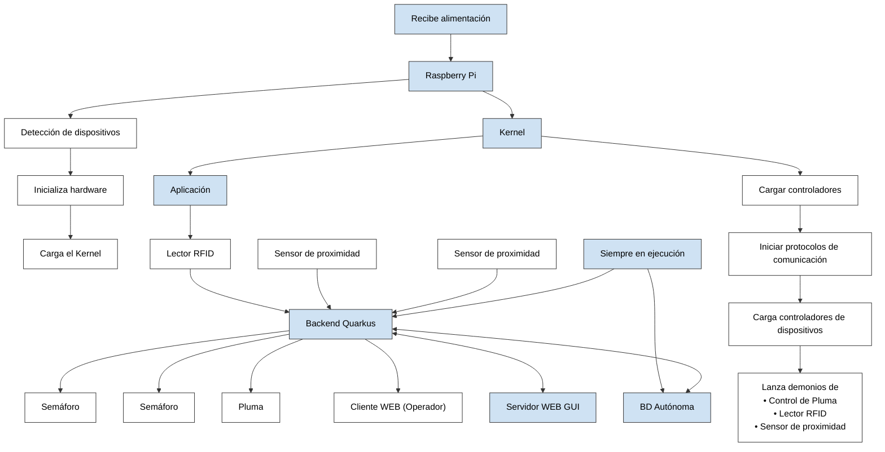

## Octubre 23

### Diagrama de arranque del

```mermaid
flowchart TD
    %% Estilos basados en el diagrama original
    classDef blueBox fill:#cfe2f3,stroke:#333333,stroke-width:1px,color:#000000;
    classDef whiteBox fill:#ffffff,stroke:#333333,stroke-width:1px,color:#000000;

    %% ----------------------------------------------------
    %% 1. Secuencia principal superior (Arranque)
    %% ----------------------------------------------------
    A["Recibe alimentación"]:::blueBox --> B["Raspberry Pi"]:::blueBox
    B --> C["Kernel"]:::blueBox
    C --> D["Aplicación"]:::blueBox

    %% ----------------------------------------------------
    %% 2. Rama Hardware (bajo Raspberry Pi)
    %% ----------------------------------------------------
    B --> B1["Detección de dispositivos"]:::whiteBox
    B1 --> B2["Inicializa hardware"]:::whiteBox
    B2 --> B3["Carga el Kernel"]:::whiteBox

    %% ----------------------------------------------------
    %% 3. Rama Kernel (Controladores y demonios)
    %% ----------------------------------------------------
    C --> C1["Cargar controladores"]:::whiteBox
    C1 --> C2["Iniciar protocolos de comunicación"]:::whiteBox
    C2 --> C3["Carga controladores de dispositivos"]:::whiteBox
    C3 --> C4["Lanza demonios de<br>• Control de Pluma<br>• Lector RFID<br>• Sensor de proximidad"]:::whiteBox

    %% ----------------------------------------------------
    %% 4. Dispositivos / Sensores de entrada
    %% ----------------------------------------------------
    D --> S1["Lector RFID"]:::whiteBox
    S2["Sensor de proximidad"]:::whiteBox
    S3["Sensor de proximidad"]:::whiteBox

    %% ----------------------------------------------------
    %% 5. Actuadores / Interfaces de salida
    %% ----------------------------------------------------
    ACT1["Semáforo"]:::whiteBox
    ACT2["Semáforo"]:::whiteBox
    ACT3["Pluma"]:::whiteBox
    ACT4["Cliente WEB (Operador)"]:::whiteBox

    %% ----------------------------------------------------
    %% 6. Servicios siempre en ejecución
    %% ----------------------------------------------------
    RUN["Siempre en ejecución"]:::blueBox
    BK["Backend Quarkus"]:::blueBox
    WEB["Servidor WEB GUI"]:::blueBox
    DB["BD Autónoma"]:::blueBox

    %% ----------------------------------------------------
    %% 7. Conexiones entre componentes y Backend
    %% ----------------------------------------------------
    %% Entradas de sensores al backend
    S1 --> BK
    S2 --> BK
    S3 --> BK

    %% Salidas de control del backend hacia dispositivos
    BK --> ACT1
    BK --> ACT2
    BK --> ACT3
    BK --> ACT4

    %% Orquestación de servicios en ejecución
    RUN --> BK
    RUN --> DB
    BK <--> WEB
    BK <--> DB
```

