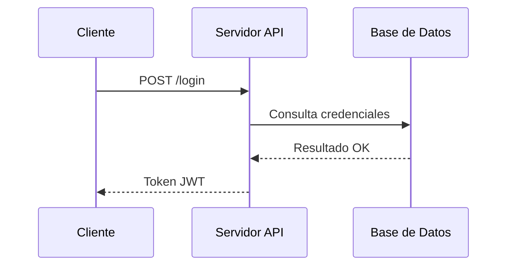

## octubre 21

El proyector: 

```mermaid

sequenceDiagram
    participant C as Cliente
    participant S as Servidor API
    participant DB as Base de Datos
    C->>S: POST /login
    S->>DB: Consulta credenciales
    DB-->>S: Resultado OK
    S-->>C: Token JWT
```

